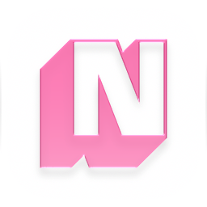
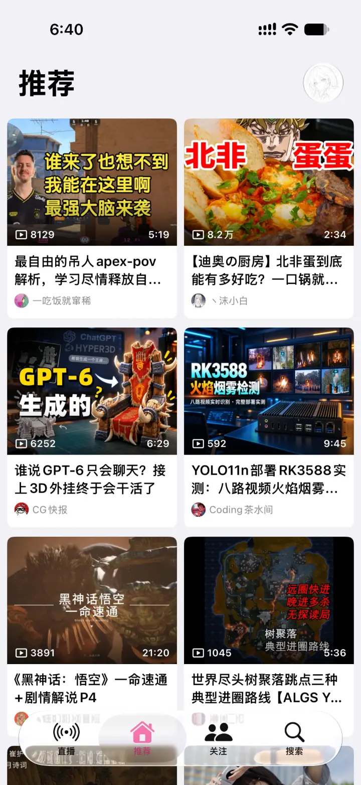
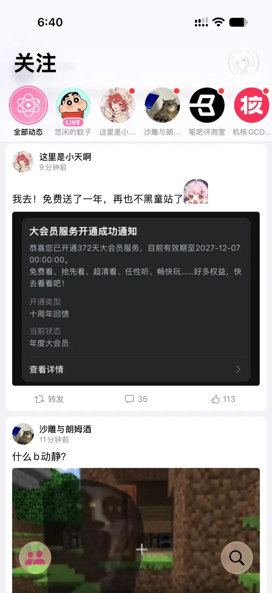
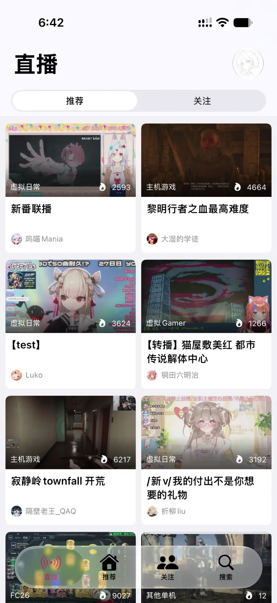
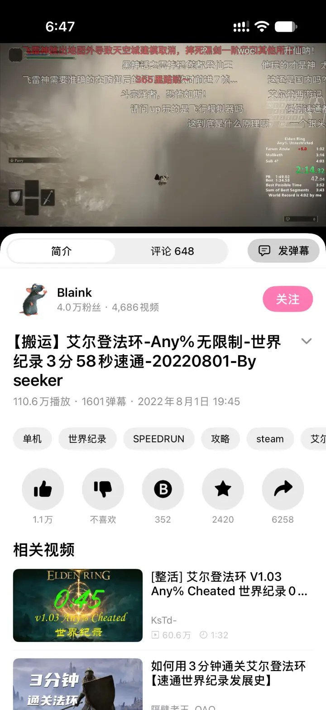

<div align="center">



# NeoBili

**A native, third-party Bilibili client for iPhone**

Built with SwiftUI · Liquid Glass on iOS 26 · Powered by MPVKit

[](https://github.com/Fab1e2000/NeoBili/releases/latest)
[](https://github.com/Fab1e2000/NeoBili/releases)
[](#installation)
[](https://www.swift.org)
[](https://developer.apple.com/xcode/swiftui/)
[](LICENSE)

**English** · [简体中文](README.zh-CN.md)

[Download](#installation) · [Features](#features) · [Build from source](#building-from-source) · [Changelog](docs/releases)

</div>

<br>

## Screenshots

<table>
  <tr>
    <td align="center"><br><sub><b>Recommended</b></sub></td>
    <td align="center"><br><sub><b>Following</b></sub></td>
    <td align="center"><br><sub><b>Live</b></sub></td>
    <td align="center"><br><sub><b>Video &amp; danmaku</b></sub></td>
  </tr>
</table>

<p align="center"><sub>Screenshots show the Chinese UI. The app also ships a full English interface.</sub></p>

> [!IMPORTANT]
> NeoBili is an unofficial client developed independently by an individual. It is not affiliated with, authorized, or endorsed by Bilibili. It is free, for personal and educational use only, and may not be used commercially. Please read the [Disclaimer](DISCLAIMER.md) before use.

## Why NeoBili

[Bilibili](https://www.bilibili.com) is one of the largest video and live-streaming communities in China. NeoBili is an iPhone client for it written entirely in SwiftUI and Swift 6. It follows iOS conventions and Liquid Glass instead of mirroring a cross-platform design, and it collects no data.

## Features

### Discover

- **Two-column feed** that shows cover, length and views at a glance. Tap *Recommended* again to jump to the top, or to refresh when you're already there.
- **Search** built into the tab bar, with trending searches listed one per line.
- **Content filters** that can hide vertical videos or ones shorter than a set length. Lists are filtered before they appear, so nothing pops in and then disappears.

### Following & Live

- **Avatar strip** under the title that puts creators who are live or just posted first. Tap one to switch the feed instantly; *All Following* shows everyone you follow on one page.
- **Unread dots synced with Bilibili.** Opening a creator clears the dot and notifies Bilibili the same way the web client does.
- **LIVE badges** for creators who are streaming. Long-press an avatar to jump into the room.
- **Dedicated Live tab** with Recommended and Following lists, quality switching, reconnect and sharing. It connects over FLV first and falls back to HLS.

### Watch

- **Keep watching.** Leave a video or stream and it shrinks into a mini player that collapses with the tab bar. Tap the title to bring it back.
- **Send danmaku** (Bilibili's scrolling comments) from the video page or in full screen. Your own messages get a green outline. Colored danmaku can be turned off.
- **Native glass controls.** Full-screen controls stay clear of rounded corners and the Dynamic Island, and you can reposition them. Resolution and audio quality each have their own menu.
- **Fits every aspect ratio.** The player follows each video's real shape, vertical videos shrink as you swipe up, and playback position is remembered per video and per part.
- **Gestures** for brightness, full screen and volume, with adjustable zone boundaries. Swipe horizontally to seek.

### Make it yours

- **24 theme colors**, each with a matching home-screen icon.
- **Title bar** that stays pinned or scrolls away, the same on every main page.
- **Tab bar** you can reorder, hide tabs in, or pick a launch tab for. Watch Later, Favorites and History can be tabs too.
- **English and Chinese UI**, following the system language by default. English uses Bilibili's own terms (UP, Danmaku, Coin).
- **Fine-tuning**: 7 text sizes, per-page card animations, pull-to-refresh distance, and a left-edge guard against accidental taps.

The [user guide](docs/USAGE.md) describes every setting in detail (currently in Chinese).

## Requirements

- iPhone running iOS 26.0 or later (iPad is not supported yet)
- To build: Xcode with the iOS 26 SDK and Swift 6
- To run on a device: an Apple ID or developer account that can sign apps

## Installation

NeoBili is distributed as an **unsigned IPA**, which you sign yourself before installing.

1. Download `NeoBili-vX.Y.Z-unsigned.ipa` from the [latest release](https://github.com/Fab1e2000/NeoBili/releases/latest).
2. Verify it with the `SHA256SUMS.txt` file from the same release:
   ```sh
   shasum -a 256 -c SHA256SUMS.txt
   ```
3. Sign it with your own developer certificate or your preferred signing tool, then install it on your device.

## Building from source

**Prerequisites:** Xcode with the iOS 26 SDK. Swift Package Manager resolves the only dependency, [MPVKit](https://github.com/mpvkit/MPVKit).

```sh
git clone https://github.com/Fab1e2000/NeoBili.git
cd NeoBili
open NeoBili.xcodeproj
```

1. Wait for Swift Package Manager to resolve MPVKit.
2. Under **Signing & Capabilities**, choose your development team and change the bundle identifier if needed.
3. Select the `NeoBili` scheme and your device, then build and run.

To compile for devices without signing:

```sh
xcodebuild -project NeoBili.xcodeproj -scheme NeoBili \
  -destination 'generic/platform=iOS' CODE_SIGNING_ALLOWED=NO build
```

The Xcode project is generated from `project.yml` with [XcodeGen](https://github.com/yonaskolb/XcodeGen). Run `xcodegen` to regenerate it.

## Project layout

```text
.
├── NeoBili/
│   ├── App/              # App entry, root view and tab settings
│   ├── Core/
│   │   ├── Models/       # Data models and settings
│   │   ├── Networking/   # API client, request signing, endpoints
│   │   ├── Platform/     # Orientation control
│   │   ├── UI/           # Themes, glass components and shared views
│   │   └── …             # Diagnostics and extensions
│   ├── Features/         # Home, Following, Live, Search, Player, Danmaku,
│   │                     # Video detail, Library, Mine, Settings and more
│   └── Resources/        # 24 theme app icons, assets and localizations
├── NeoBiliTests/         # Unit tests
├── offline-harness/      # Offline logic tests that run directly on macOS
├── design/               # App icon sources
├── scripts/              # Icon generation and other scripts
└── docs/                 # Architecture, user guide and release notes
```

- **Architecture:** module map, data flow and state ownership in [docs/ARCHITECTURE.md](docs/ARCHITECTURE.md).
- **Tests:** run the offline regression suite with `zsh offline-harness/run.sh`. It needs no device or simulator.
- **Icon:** the extruded N icon's editable source is in [`design/app-icon-2026/`](design/app-icon-2026/). `scripts/generate-app-icons.py` generates all 24 theme variants.

## Documentation

| Document | Contents |
| --- | --- |
| [User guide](docs/USAGE.md) | Detailed behavior of playback, live, following, animation and gesture settings (Chinese) |
| [Architecture](docs/ARCHITECTURE.md) | Module map and where new features belong (Chinese) |
| [Settings notes](docs/SETTINGS.md) | Settings keys, compatibility and wiring (Chinese) |
| [Release notes](docs/releases) | What changed in each version (Chinese) |
| [Third-party notices](THIRD_PARTY_NOTICES.md) | Licenses of dependencies and reference projects |
| [Disclaimer](DISCLAIMER.md) | Relationship with Bilibili, content and data, user responsibility |

## Contributing

Bug reports and feature requests are welcome in [Issues](https://github.com/Fab1e2000/NeoBili/issues). Before opening a pull request, please make sure the project builds and `zsh offline-harness/run.sh` passes.

## Known limitations

- Bilibili does not publish or guarantee these APIs. Server-side changes can break features until NeoBili is updated.
- Resolutions, audio quality and some content depend on your account, membership, copyright and region.
- NeoBili does not download videos and does not try to get around paid, membership or regional restrictions.
- Releases are unsigned IPAs. There is no App Store or TestFlight build.
- iPhone only for now. The user guide, architecture notes and release notes are in Chinese.

## Disclaimer

- NeoBili is an **unofficial** third-party client developed independently by an individual. It has no affiliation, partnership or authorization with Bilibili. "Bilibili", "哔哩哔哩" and related marks belong to their respective owners.
- NeoBili **does not host, re-upload or redistribute** any content. Videos, streams, comments and other content are requested directly from Bilibili's public services by your device, and their copyrights belong to the original creators.
- It offers **no** video downloading and **no** way around paid or membership restrictions. It runs **no servers** and collects no user data. Login credentials stay in your device's Keychain.
- It is free, for personal and educational use only, and **may not be used commercially**. You are responsible for complying with applicable laws and Bilibili's Terms of Service, and you use it at your own risk.
- Rights holders who believe this project infringes their rights can reach us through [Issues](https://github.com/Fab1e2000/NeoBili/issues). We will review each report promptly.

The full terms are in [DISCLAIMER.md](DISCLAIMER.md).

## License

NeoBili's source code is released under the [MIT License](LICENSE). The license covers this project's own code only and grants no rights to any Bilibili content, trademark or service. Third-party dependencies are covered by their own licenses; see [THIRD_PARTY_NOTICES.md](THIRD_PARTY_NOTICES.md).

## Acknowledgements

- [youshen2/MeloX](https://github.com/youshen2/MeloX): a native SwiftUI, Liquid Glass third-party client for NetEase Cloud Music, and the model for this README.
- [guozhigq/pilipala](https://github.com/guozhigq/pilipala): the Flutter Bilibili client PiliPlus grew out of. NeoBili's extruded N icon is modeled on its logo.
- [bggRGjQaUbCoE/PiliPlus](https://github.com/bggRGjQaUbCoE/PiliPlus): reference for API usage and playback behavior. The pinned revision is recorded in [references/README.md](references/README.md).
- [mpvkit/MPVKit](https://github.com/mpvkit/MPVKit): the libmpv-based playback engine (LGPL build).

These projects remain under their own licenses.
