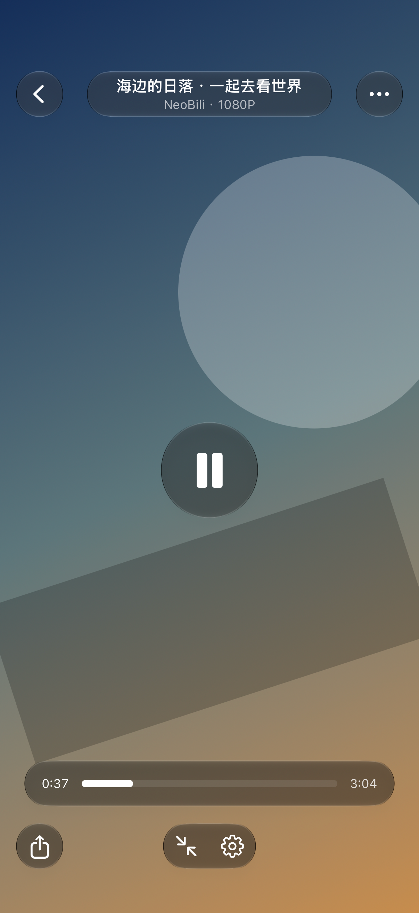
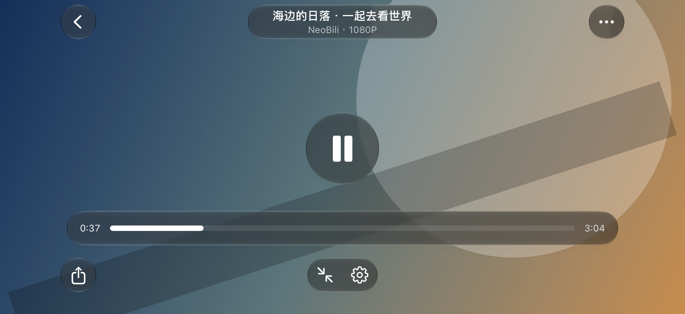
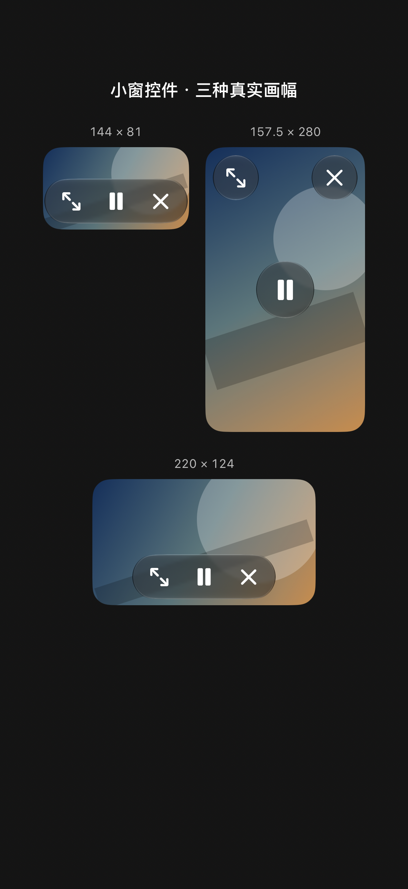
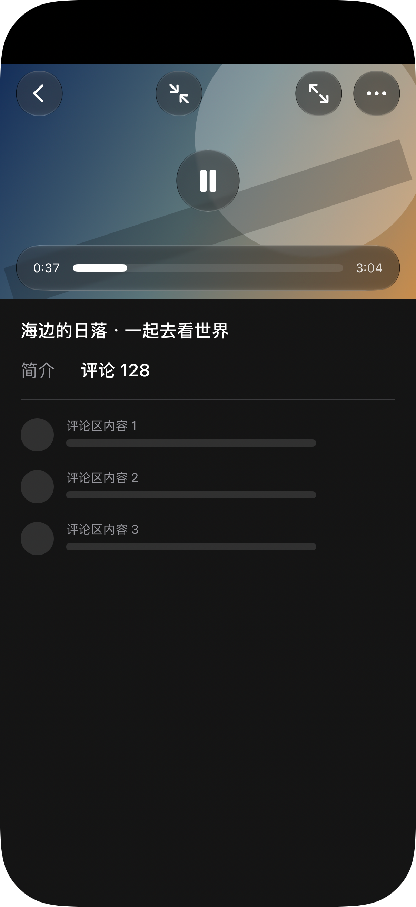
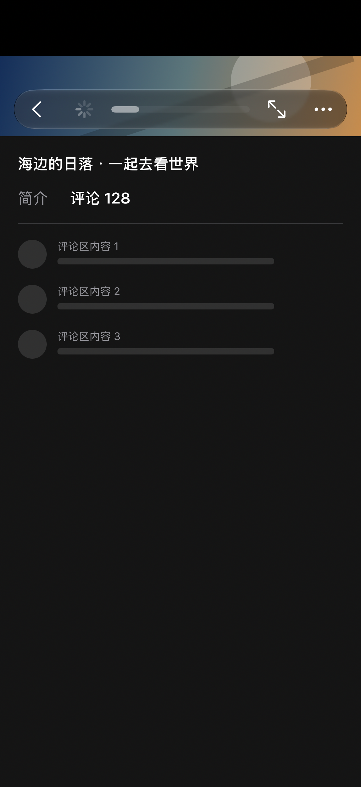

# 播放器玻璃控件验证

2026-09-10。按用户提供的 Telegram 截图重做播放器控制层，并统一应用到小窗。圆形返回／更多、两行标题胶囊、92 pt 中央播放键、独立胶囊进度条和底部工具沿用截图的视觉结构；动作仍对应 NeoBili 的播放、画质、音质、休眠、分享和收缩。

## 实现与边界

- `PlayerGlassChrome` 与 `MiniPlayerControls` 共用 SwiftUI 原生 `glassEffect`，深色环境保证白色符号对比；使用 `GlassEffectContainer` 管理相邻材质。Button、Menu、ShareLink 与 Slider 保持原生交互。
- 系统 Slider 通过 `sliderThumbVisibility` 隐藏常驻滑块，拖动时恢复；松手或辅助功能调整时提交跳转。无第二套透明 Slider 或手绘进度轨道。
- 较高画幅采用分离控件，标准画幅保留中央播放键并精简顶部信息，超宽矮画幅合并为底部胶囊。所有动作保留至少 44 pt 命中区。
- 小窗保留原 UIKit 拖动、吸附和播放器交接。9:16 实际小窗尺寸为 157.5 × 280 pt，可显示分离圆形控件；矮小窗使用 140 × 44 pt 三按钮胶囊。
- 加载／缓冲直接占用传输控件位置，避免独立指示器与播放键重叠；已有首帧时可在缓冲中暂停。读屏标签区分等待与可执行动作。减少动态效果关闭自定义淡入淡出，VoiceOver 下停止自动隐藏。

原生 API：[glassEffect](https://developer.apple.com/documentation/swiftui/view/glasseffect(_:in:))、[GlassEffectContainer](https://developer.apple.com/documentation/swiftui/glasseffectcontainer)、[sliderThumbVisibility](https://developer.apple.com/documentation/swiftui/view/sliderthumbvisibility(_:))。

## 验证记录

- iPhone 17 真机回归 72 项、0 失败：播放器控制／进度保存、竖屏方向、加载和暂停收缩、小窗状态、原生容器拖动与渲染归属，以及新增玻璃控件测试。
- 修订真实小窗尺寸和单一加载指示器后，重新执行 3 项控件测试，0 失败。包含 90 组布局区间断言、7 种画幅／状态截图及 3 种小窗尺寸对照图。
- Debug 真机测试包与 Release 真机构建成功，全程未使用 Simulator。
- 初轮结果包 `/tmp/NeoBiliGlassControls-20260910.xcresult`；加载和小窗修订结果包 `/tmp/NeoBiliGlassControlsFinal-20260910.xcresult`；构建日志 `/tmp/neobili-glass-controls-build.log`、`/tmp/neobili-glass-controls-release.log`。
- 最终布局复核结果 `/tmp/NeoBiliGlassControlsGeometry-20260910.xcresult`，3 项测试均通过。截图测试容器禁用重复的自动安全区后，实际 UIKit 坐标探针确认横屏控件完整占据 `(0, 0, 874, 402)`；内部按钮按左右 62 pt、底部 20 pt 的真机安全区避让。7 种画幅的实际位置和尺寸均在 0.5 pt 容差内。对应 [横屏坐标记录](landscape-geometry.txt)。
- 最终 Release 已安装并成功启动于 iPhone 17，包名 `com.elsterlee.NeoBili`。记录：`/tmp/neobili-glass-controls-install.json`、`/tmp/neobili-glass-controls-launch.json`。

快照直接托管生产 SwiftUI 控件于真机 UIWindow，背景为本地颜色与形状，无网络视频或 MPV 会话。它们验证材质与布局，不代表测得整 App 帧率、真实视频质量或手动触屏拖动表现。既有播放状态测试会创建播放会话；测试报告记录了 AVAudioSession 主线程操作的运行时警告，本次没有修改音频会话实现。

